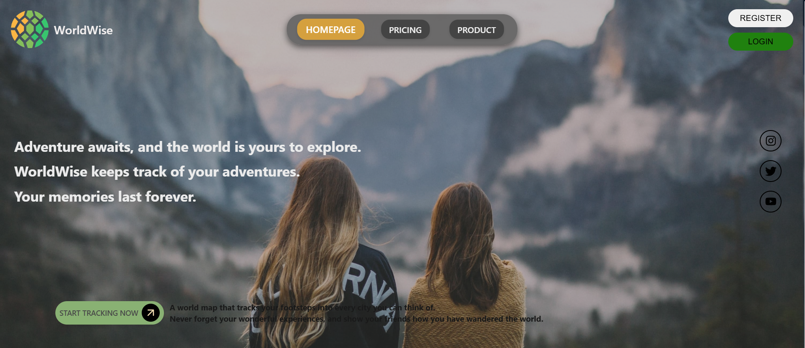
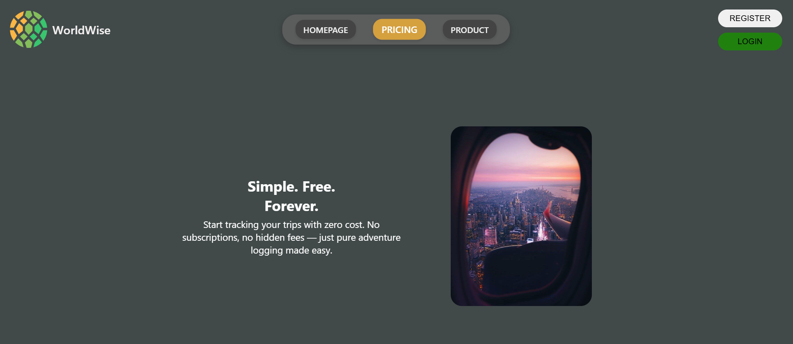
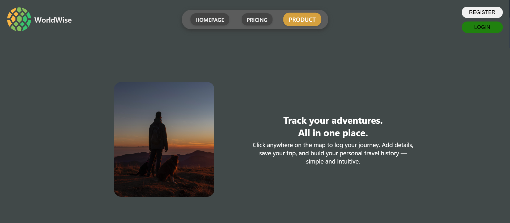
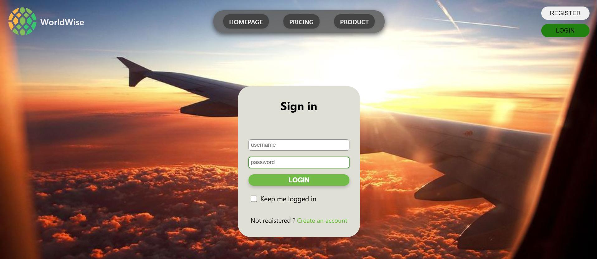
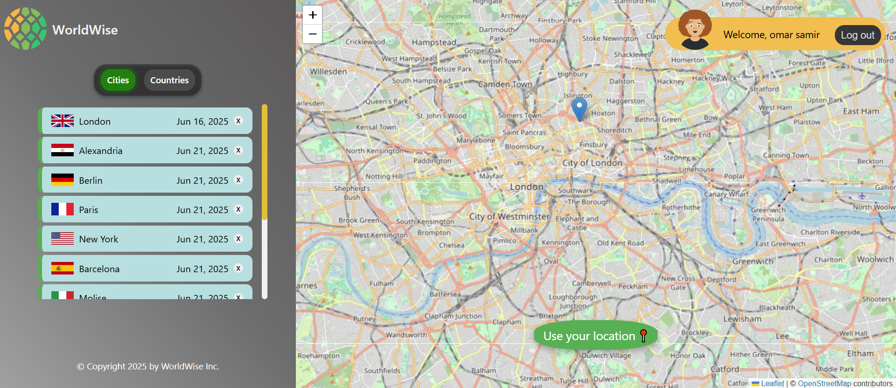
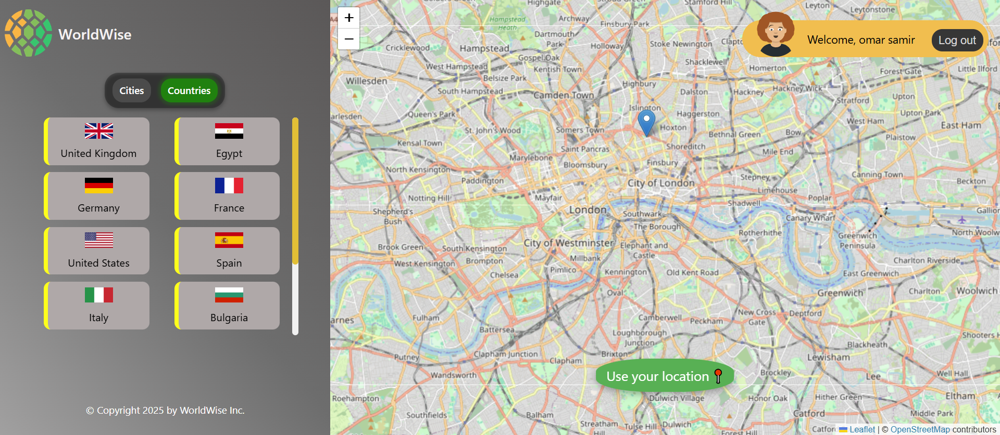
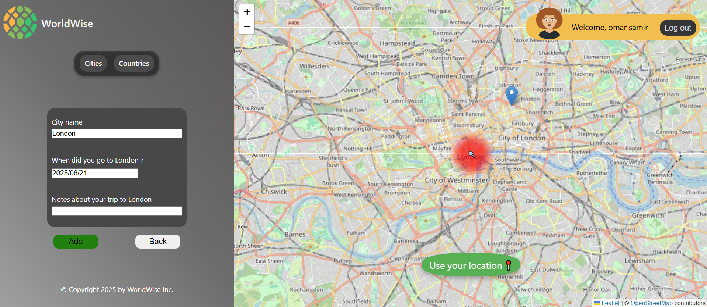
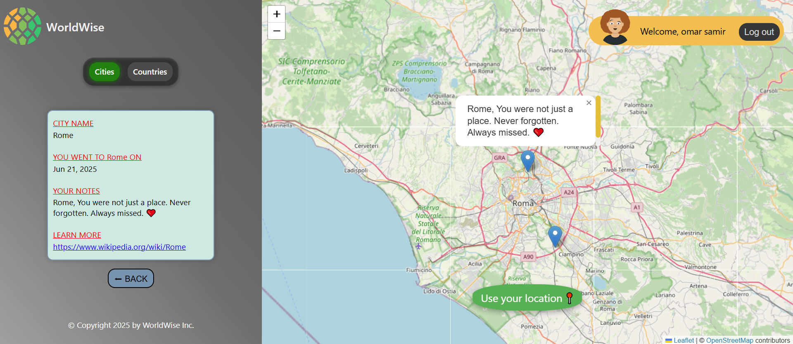

## 📚 Table of Contents

- [World Wise](#world-wise-)
- [Live Demo](#-live-demo)
- [Screenshots](#-screenshots)
- [Features](#-features)
- [Tech Stack](#-tech-stack)
- [Getting Started](#-getting-started)
- [About the Author](#about-the-author)

# World Wise 🌍

**World Wise** is a responsive travel tracking web application that lets users visually map and manage their travel experiences around the world. With an interactive map interface, you can mark cities you've visited, add detailed trip information, and see your adventures come to life.

The app provides a smooth and intuitive experience for logging trips, including the ability to specify the location, date, and description of each journey. Trips are displayed as pins on a world map and listed separately in both a **visited cities list** and a **visited countries list** — helping you keep track of your travels at a glance.

Users can create an account and log in securely to personalize their experience. Each account allows for saving, updating, and viewing individual travel histories .

## 🔗 Live Demo

[Click here to try it](https://world-wise-v2.netlify.app/)

## 🖼 Screenshots

  









## 🚀 Features

### 🧭 Core Functionality

- Interactive world map powered by **Leaflet**
- Clickable map with popup forms to add new trips
- Add trip details (location, date, description)
- Fetch and update city data using a RESTful API
- View list of added trips and visited countries
- Responsive, mobile-friendly design

### 💾 Data Management

- Local data persistence using `localStorage` (simulated backend)
- UI state stored in URL (for deep-linking and sharing)

### 🔐 User Experience

- Authentication via **Firebase**
- Create accounts and login functionality
- Lazy loading for better image performance
- Automatic retry for fetching country flags (if failed)
  - If fetching a country's flag fails (e.g., due to a network error), the app automatically retries on the next app launch
- **Tile Loading Fallback Mechanism**: In case of tile loading failure (e.g., network error or CORS issue), the app retries up to two times and intelligently switches between four different map tile providers to maintain map availability and a smooth user experience.

## 🛠 Tech Stack

- **React** – Frontend UI library
- **React Router DOM v5** – Client-side routing
- **Leaflet** & **React-Leaflet** – Interactive maps
- **React Datepicker** – Trip date selection
- **React Icons** – Interface icons
- **Context API + useReducer** – UI state management
- **RESTful APIs**
- **localStorage API** – For storing trip data in the browser
  Simulated backend using `localStorage`:
  - Trip data is stored locally in the browser
  - App retrieves and displays this data as if fetching from a real server
- **CSS Modules** – Locally scoped styling

- **Firebase** – Authentication / data
- **Create React App** – Project bootstrapping
- **ESLint** – Linting and code quality

## 🛠 Getting Started

To run the project locally:

```bash
# 1. Clone the repository
git clone https://github.com/omar-samir-1/world-wise.git

# 2. Navigate to the project folder
cd world-wise

# 3. Install dependencies
npm install

# 4. Run the app
npm start
```

## About the Author

I'm Omar Samir, a frontend developer passionate about building interactive web experiences.

- [LinkedIn](https://www.linkedin.com/in/omarsamir1/)
- Gmail : [omarsamir19971@gmail.com](mailto:omarsamir19971@gmail.com)
- [GitHub](https://github.com/omar-samir-1)
